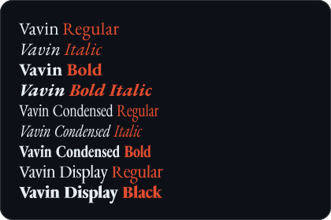
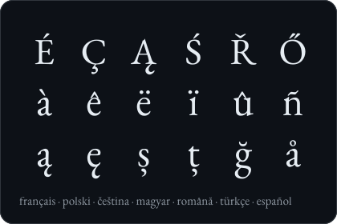

<div align="center">

<picture>
  <source media="(prefers-color-scheme: light)" srcset="docs/assets/hero-light.svg">
  
</picture>

# Vavin

**A Garamond with a large x-height, for reading on screens.** Nine free fonts in three families, derived from
EB Garamond, with lowercase letters that reach 0.72 of the cap height instead of 0.62.

<a href="https://github.com/adrbn/vavin/releases/latest"></a>&nbsp;
<a href="https://adrbn.github.io/vavin/"></a>&nbsp;
<a href="docs/TECHNICAL.md"></a>&nbsp;
<a href="#license"></a>

[](OFL.txt)
[](#the-families)
[](docs/TECHNICAL.md#the-numbers)
[](docs/TECHNICAL.md#the-numbers)
[](https://github.com/adrbn/vavin/releases/latest)

<sub>Free and open source · TTF, WOFF2 and Latin app subsets · macOS, Windows, Linux, the web and iOS</sub>

English · [Français](README.fr.md)

</div>

---

Vavin takes EB Garamond, Georg Duffner and Octavio Pardo's open revival of Claude Garamont's roman, and raises its
x-height by 16% while the capitals and ascenders stay where they were. At the same point size a line of Vavin reads
larger and sets 6% shorter, with the same density of ink on the page. It was made for the
[Aura](https://github.com/adrbn/aura) music app and is free for anyone to use, modify and redistribute.

## What it looks like

<table>
  <tr>
    <td width="50%"></td>
    <td width="50%"></td>
  </tr>
  <tr>
    <td></td>
    <td></td>
  </tr>
  <tr>
    <td></td>
    <td></td>
  </tr>
</table>

The full specimen, with every style live in the browser, is at **[adrbn.github.io/vavin](https://adrbn.github.io/vavin/)**.

## Install

Download `Vavin-v1.1.zip` from the [latest release](https://github.com/adrbn/vavin/releases/latest). Each family has
three folders: `ttf/` (full character set, for desktop use), `app/` (Latin subset, for embedding) and `web/` (WOFF2).

**macOS.** Open the `.ttf` files and click *Install Font* in Font Book, or copy them to `~/Library/Fonts`.

**Windows.** Select the `.ttf` files, right-click and choose *Install* (or *Install for all users*).

**Linux.** Copy the `.ttf` files to `~/.local/share/fonts` and run `fc-cache -f`.

**Web.** Serve the files from `web/` and declare one `@font-face` per style:

```css
@font-face {
  font-family: "Vavin";
  src: url("fonts/Vavin-Regular.woff2") format("woff2");
  font-weight: 400;
  font-style: normal;
  font-display: swap;
}
@font-face {
  font-family: "Vavin";
  src: url("fonts/Vavin-Italic.woff2") format("woff2");
  font-weight: 400;
  font-style: italic;
  font-display: swap;
}

body { font-family: "Vavin", Georgia, serif; }
h1   { font-family: "Vavin Condensed", "Vavin", serif; }
```

The family names are `Vavin`, `Vavin Condensed` and `Vavin Display`. Bold is weight 700; Display Black is 800.

**iOS and SwiftUI.** Add `Vavin-Regular-Latin.ttf` and `Vavin-Bold-Latin.ttf` from `app/` to your target, check they
appear under *Build Phases → Copy Bundle Resources*, and list their file names under `UIAppFonts` in Info.plist. Then
call them by PostScript name, relative to a text style so Dynamic Type keeps working.
[`ios/VavinFont.swift`](ios/VavinFont.swift) wraps this in a small type scale:

```swift
Text("Écouter autrement").font(.custom("Vavin-Bold", size: 26, relativeTo: .title))
Text(body).font(.vavin(17, relativeTo: .body)).vavinLeading(1.40, size: 17)
```

The Latin subsets keep the combining accents, because iOS and macOS store file names decomposed (`e` + U+0301).

## The families

| Family | Styles | For | x-height / cap |
|---|---|---|---:|
| **Vavin** | Regular, Italic, Bold, Bold Italic | text, app interfaces, long reading | 0.719 |
| **Vavin Condensed** | Regular, Italic, Bold | headlines, narrow columns | 0.719 |
| **Vavin Display** | Regular, Black | titles and posters, set large | 0.758 |

EB Garamond's ratio is 0.620. Every family has a line height of 1.20 em and the same character set as EB Garamond:
Latin, Greek and Cyrillic, 2091 code points in the upright styles. They are three families rather than one because
an OpenType family only links four styles (regular, italic, bold, bold italic) before applications start faking bolds.

## How it's made

Scaling the lowercase would also stretch the ascenders and flatten the contrast between thick and thin strokes. So
the build maps heights through a smooth curve instead: the body of each lowercase letter is scaled up as a whole, the
compression is hidden in the straight middle of the ascender stems, and serifs are moved, not resized. Italics are
straightened before the remap and slanted back after it. A directional filter then thins the hairlines to restore
contrast, and every accent is lifted by exactly as much as its own base letter grew.

Everything is a script, from the upstream download to the release zip, and every number in this README is measured
by `scripts/13_facts.py`. The method, the measurements and the known limitations are in
**[docs/TECHNICAL.md](docs/TECHNICAL.md)**.

## Build from source

Needs [uv](https://docs.astral.sh/uv/) and HarfBuzz (`brew install harfbuzz`).

```bash
make setup      # .venv with fontTools, fontmake, FontBakery, HarfBuzz
make upstream   # fetch EB Garamond from google/fonts, checksum-verified
make fonts      # build the nine fonts and their Latin subsets
make specimen   # sort dist/ by family, write the WOFF2 and the specimen assets
make check      # per-glyph checks on every font
make qa         # FontBakery on Vavin and on EB Garamond, diffed
make zip        # release/Vavin-v1.1.zip
make readme-art # regenerate the SVGs in docs/assets/
```

`make serve` opens the specimen at <http://localhost:8731>. The README art is drawn from the built fonts' own
outlines, so build the fonts before regenerating it.

## Support

Vavin is free. If it is useful to you:

<a href="https://ko-fi.com/adrbn"></a>

A star on the repository helps other people find it.

## License

Vavin is licensed under the [SIL Open Font License 1.1](OFL.txt). You may use it in any project, commercial or not,
embed it in apps and documents, modify it and redistribute it. The one thing you may not do is sell the fonts on
their own. Copyright 2026 adrbn, with the EB Garamond copyright retained as the licence requires.

**"Vavin" is a Reserved Font Name** (from version 1.1): you may modify and redistribute the fonts, but a modified
version must be given another name. The OFL makes Vavin free for good: it can neither be relicensed nor sold on its
own, because EB Garamond's licence carries over to everything derived from it. Vavin is derived from EB Garamond
only; it contains no data from ITC Garamond or any other proprietary typeface, and borrows only a proportion, which is
a fact rather than a protected design. [LEGAL.md](LEGAL.md) sets out the sources, the licence obligations and the
trademark screening of the name.

## Credits

- [EB Garamond](https://github.com/octaviopardo/EBGaramond12) by Georg Duffner and Octavio Pardo, under the SIL Open
  Font License 1.1, with RCS citation glyphs by Deborah Khodanovich. Vavin's outlines are theirs.
- Claude Garamont, whose sixteenth-century romans EB Garamond revives.
- The name is the rue Vavin in Paris, which runs down to the Montparnasse crossroads and its cafés.
- The *In Aura* card is a real capture of [Aura](https://github.com/adrbn/aura) on the developer's own library. The
  French texts in the cards were written for this README.

<sub>Vavin is not affiliated with ITC, Monotype or Google. All trademarks belong to their respective owners.</sub>
